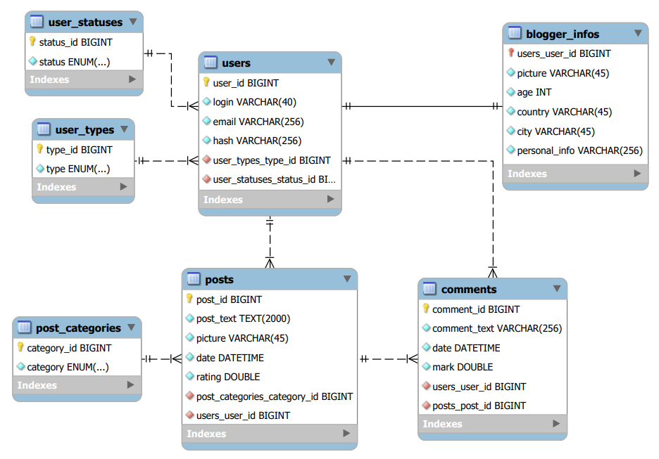

# Food blog
Food blog is a service for sharing recipes. The platform allows new users to create new recipes,    
share them, rate other users' recipes and comment on them. Service administrators can confirm user registration,  
block and unblock users, delete posts and comments. Also, all users can change the language.
## Roles in project
### Unauthorised user
- Change language
- View all posts
- View users profile pages
- Search posts by dish name
- Sign in
- Sign up
### Blogger
- Change language
- View all posts
- View users profile pages
- Search posts by dish name
- Edit personal information
- Make new post
- Delete his post
- Rate the post
- Comment post
- Logout
### Admin
- Change language
- View all posts
- View users profile pages
- Search posts by dish name
- Block/Unblock user
- Confirm users registration
- Delete any post
- Delete any comment
- Logout

## DataBase Scheme

